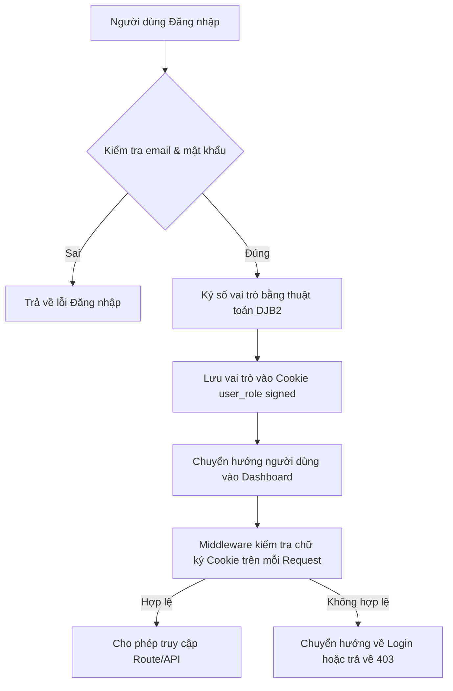
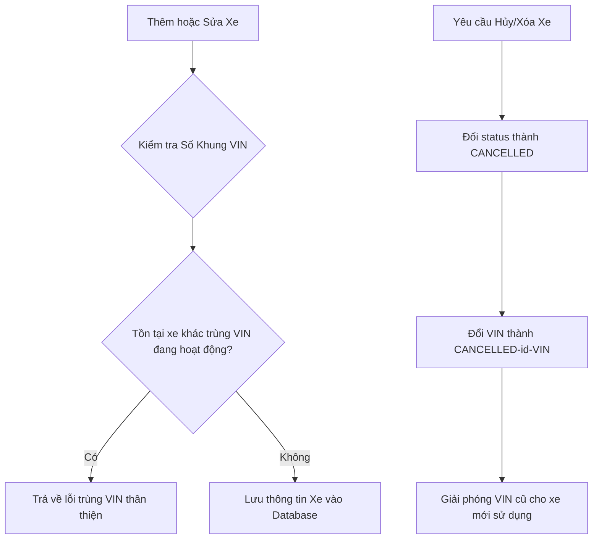
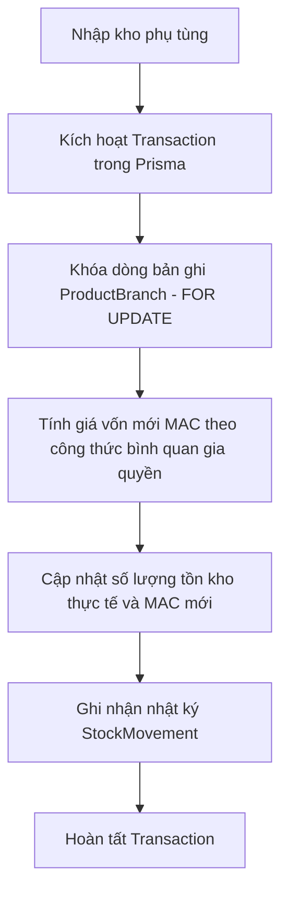
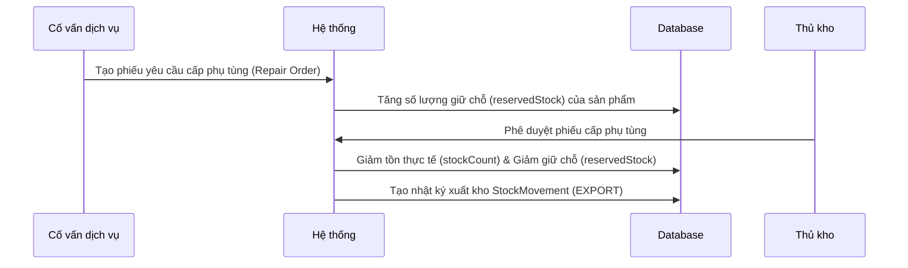
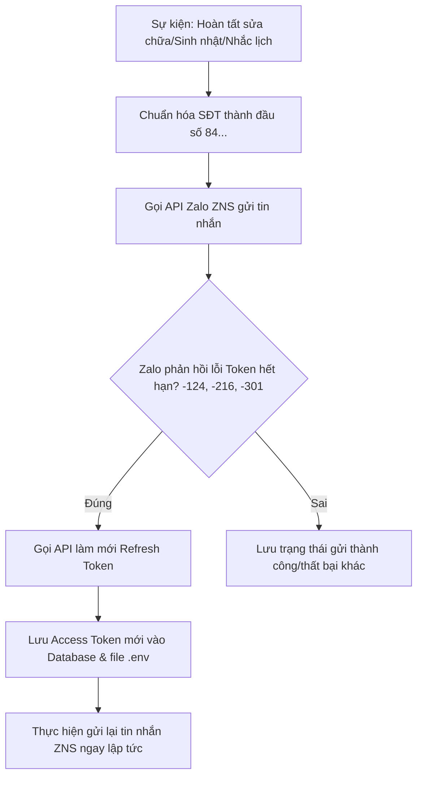

# TÀI LIỆU TOÀN BỘ LUỒNG XỬ LÝ CODE — AUTO-SMART CRM & ERP

Tài liệu này mô tả chi tiết cách thức hoạt động, luồng xử lý dữ liệu (data flow), và logic nghiệp vụ của các chức năng cốt lõi trong hệ thống **AUTO-SMART CRM & ERP**.

---

## MỤC LỤC
1. [Luồng Xác Thực & Phân Quyền (Auth & RBAC)](#1-luồng-xác-thực--phân-quyền-auth--rbac)
2. [Luồng Quản Lý & Kinh Doanh Xe (Vehicle Sales Workflow)](#2-luồng-quản-lý--kinh-doanh-xe-vehicle-sales-workflow)
3. [Luồng Quản Lý Phụ Tùng & Kho (Inventory Workflow)](#3-luồng-quản-lý-phụ-tùng--kho-inventory-workflow)
4. [Luồng Yêu Cầu Cấp Phụ Tùng & Xưởng Dịch Vụ (Workshop Workflow)](#4-luồng-yêu-cầu-cấp-phụ-tùng--xưởng-dịch-vụ-workshop-workflow)
5. [Luồng Tích Hợp Chăm Sóc Khách Hàng Zalo OA (ZNS Flow)](#5-luồng-tích-hợp-chăm-sóc-khách-hàng-zalo-oa-zns-flow)
6. [Luồng Tự Động Sao Lưu Cơ Sở Dữ Liệu (Backup Flow)](#6-luồng-tự-động-sao-lưu-cơ-sở-dữ-liệu-backup-flow)

---

## 1. LUỒNG XÁC THỰC & PHÂN QUYỀN (AUTH & RBAC)

Hệ thống sử dụng cơ chế bảo mật Role-Based Access Control (RBAC) kết hợp cookie ký số để bảo vệ dữ liệu ở cả giao diện (Client-side) và API (Server-side).

### Biểu đồ luồng xác thực:


### Logic xử lý chi tiết trong Code:
1. **Đăng nhập (`/api/auth/login`)**:
   * Kiểm tra thông tin tài khoản bằng Prisma.
   * Sử dụng hàm `signRole(role)` (tại `src/lib/auth.ts`) để băm vai trò người dùng kết hợp với khóa bí mật `COOKIE_SIGN_SECRET`.
   * Trả về cookie `user_role` dưới dạng chuỗi đã ký (ví dụ: `ADMIN.xxxxxx`).
2. **Kiểm soát truy cập (`src/middleware.ts`)**:
   * Đối với mỗi request đi qua Middleware, hàm `verifyRole(cookieValue)` sẽ được gọi để giải mã và kiểm tra tính toàn vẹn chữ ký.
   * So khớp vai trò với danh sách quyền hạn định nghĩa trong `src/config/rbac.ts`.
   * Nếu người dùng cố gắng vào tuyến đường không được phép, Middleware sẽ chặn lại và trả về lỗi `403` (đối với API) hoặc chuyển hướng về trang chủ mặc định của vai trò đó.
3. **Hiển thị Menu (`src/config/navigation.ts`)**:
   * Client-side đọc vai trò từ trạng thái xác thực và lọc danh sách Menu bên trái, chỉ hiển thị những chức năng mà tài khoản đó có quyền sử dụng.

---

## 2. LUỒNG QUẢN LÝ & KINH DOANH XE (VEHICLE SALES WORKFLOW)

Quản lý thông tin xe mua bán và quản lý dữ liệu số khung (VIN) đảm bảo tính duy nhất nhưng vẫn cho phép tái sử dụng số khung khi xe cũ bị hủy.

### Biểu đồ luồng nghiệp vụ Xe:


### Logic xử lý chi tiết trong Code:
1. **Tạo mới xe (`POST /api/sales`)**:
   * Giải phóng các xe đã bị hủy (`CANCELLED`) nhưng chưa đổi tên VIN để tránh lỗi đụng độ dữ liệu.
   * Truy vấn tìm xe đang hoạt động (`status !== "CANCELLED"`) trùng với VIN nhập vào.
   * Nếu phát hiện trùng lặp, trả về lỗi: `Số khung (VIN) này đã tồn tại trên một xe khác đang hoạt động.`
   * Nếu hợp lệ, tự động liên kết hoặc tạo mới thông tin khách hàng dựa trên Số điện thoại (`getOrCreateCustomer`), sau đó lưu xe vào bảng `Vehicle`.
2. **Cập nhật xe (`PATCH /api/sales/[id]`)**:
   * Kiểm tra xem thông tin xe tồn tại.
   * Nếu người dùng sửa đổi số VIN mới, hệ thống kiểm tra trùng lặp VIN đối với toàn bộ các xe đang hoạt động khác trong hệ thống (trừ chính xe đó).
3. **Hủy/Xóa xe (`DELETE /api/sales/[id]`)**:
   * Chuyển trạng thái xe thành `CANCELLED`.
   * Cập nhật số VIN thành: `CANCELLED-${id}-${originalVIN}`. Việc này giúp giải phóng số VIN gốc để người dùng có thể nhập xe mới với số VIN này bình thường.

---

## 3. LUỒNG QUẢN LÝ PHỤ TÙNG & KHO (INVENTORY WORKFLOW)

Quản lý linh kiện, tính giá vốn bình quan gia quyền và kiểm soát xuất nhập kho đa chi nhánh.

### Biểu đồ luồng nghiệp vụ Kho:


### Logic xử lý chi tiết trong Code:
1. **Thêm & Cập nhật phụ tùng (`/api/inventory`)**:
   * Áp dụng cơ chế kiểm tra trùng mã sản phẩm (SKU) tương tự như xe. Chỉ kiểm tra trùng lặp với các sản phẩm đang hoạt động (`status !== "INACTIVE"`).
   * Khi xóa sản phẩm (`DELETE`), chuyển trạng thái thành `INACTIVE` và đổi mã SKU thành `INACTIVE-${id}-${originalSKU}` để giải phóng mã SKU gốc.
2. **Tính giá vốn Bình quan gia quyền (Moving Average Cost - MAC)**:
   * Khi phát sinh hành động nhập kho (`importStock` tại `src/app/actions.ts`), hệ thống áp dụng công thức:
     $$\text{MAC}_{\text{mới}} = \frac{(\text{Tồn cũ} \times \text{MAC}_{\text{cũ}}) + (\text{Số lượng nhập} \times \text{Đơn giá nhập})}{\text{Tồn cũ} + \text{Số lượng nhập}}$$
   * Để chống **Race Condition** khi nhiều thủ kho thao tác cùng lúc, hệ thống chạy lệnh khóa dòng raw query: `SELECT * FROM "ProductBranch" WHERE ... FOR UPDATE`, đảm bảo các luồng tính toán giá vốn diễn ra tuần tự và chính xác 100%.

---

## 4. LUỒNG YÊU CẦU CẤP PHỤ TÙNG & XƯỞNG DỊCH VỤ (WORKSHOP WORKFLOW)

Quy trình phối hợp chặt chẽ giữa Cố vấn dịch vụ (Xưởng) và Thủ kho để đảm bảo linh kiện không bị thất thoát.

### Biểu đồ luồng cấp phụ tùng:


### Logic xử lý chi tiết trong Code:
1. **Tạo Lệnh sửa chữa & Yêu cầu phụ tùng**:
   * Cố vấn dịch vụ tạo phiếu yêu cầu cấp phụ tùng (`PartsRequisition`).
   * Hệ thống kiểm tra số lượng tồn khả dụng tại chi nhánh ($\text{Tồn khả dụng} = \text{Tồn thực tế} - \text{Tồn giữ chỗ}$).
   * Nếu đủ, hệ thống tăng số lượng giữ chỗ `reservedStock` của sản phẩm lên để giữ hàng. Hàng vẫn trong kho nhưng nhân viên bán lẻ khác không thể bán được nữa.
2. **Thủ kho phê duyệt xuất kho**:
   * Khi thủ kho nhấn phê duyệt, hệ thống sẽ thực hiện giao dịch: giảm `stockCount` (tồn thực tế) và đồng thời giảm `reservedStock` (tồn giữ chỗ) tương ứng, tạo một bản ghi `StockMovement` với loại `EXPORT` được liên kết trực tiếp với Lệnh sửa chữa (`RepairOrder`).
3. **Hoàn tất Lệnh & Tính hoa hồng kỹ thuật viên**:
   * Khi lệnh sửa chữa hoàn thành (`DONE`), hệ thống tự động lưu dữ liệu hiệu suất của thợ sửa chữa (`TechPerformance`) dựa trên tỷ lệ hoa hồng (`commissionRate`) thiết lập cho từng kỹ thuật viên.

---

## 5. LUỒNG TÍCH HỢP CHĂM SÓC KHÁCH HÀNG ZALO OA (ZNS FLOW)

Tự động gửi tin nhắn chăm sóc khách hàng qua Zalo Cloud (ZNS) khi có sự kiện hệ thống và tự động làm mới mã bảo mật (Token) nếu hết hạn.

### Biểu đồ luồng gửi tin Zalo:


### Logic xử lý chi tiết trong Code (`src/lib/zalo.ts`):
1. **Chuẩn hóa dữ liệu**:
   * Hàm tự động chuyển các số điện thoại từ định dạng Việt Nam (`09xxxx...`) sang định dạng quốc tế (`849xxxx...`) để phù hợp với yêu cầu của Zalo API.
2. **Cơ chế Tự động làm mới Token (Auto-Refresh)**:
   * Access Token của Zalo OA chỉ có giá trị trong 25 tiếng. Để tránh gián đoạn, khi hệ thống gửi tin nhắn thất bại do mã lỗi hết hạn token, hệ thống tự động trích xuất `refresh_token` từ Database, gửi yêu cầu lấy bộ token mới từ Zalo, lưu đè token mới vào bảng `SystemConfig` (and file `.env` nếu là local), sau đó tiếp tục gửi lại tin nhắn vừa bị lỗi mà không cần người dùng thao tác lại.

---

## 6. LUỒNG TỰ ĐỘNG SAO LƯU CƠ SỞ DỮ LIỆU (BACKUP FLOW)

Đảm bảo an toàn dữ liệu cơ sở dữ liệu trên Supabase cho gói miễn phí (Free Plan) bằng 2 kênh tự động độc lập.

### Biểu đồ luồng Backup:
```mermaid
graph TD
    subgraph Kênh 1: Đám mây GitHub Actions (Daily)
        A[Trigger: 07:00 AM hàng ngày] --> B[Khởi tạo máy ảo Ubuntu]
        B --> C[Cài đặt postgresql-client-17]
        C --> D[Chạy pg_dump phiên bản 17 kết nối Supabase]
        D --> E[Nén thành file .zip tải lên GitHub Artifacts]
        E --> F[Lưu trữ an toàn trong vòng 30 ngày]
    end

    subgraph Kênh 2: Máy Mac cá nhân (Local Cron Job)
        G[Trigger: Cron Job trên macOS] --> H[Chạy tập lệnh scripts/backup.sh]
        H --> I[Đọc DIRECT_URL trong file .env]
        I --> J[Chạy pg_dump trên máy Mac sao lưu cơ sở dữ liệu]
        J --> K[Lưu file .sql vào thư mục ~/Supabase_Backups]
        K --> L[Tự động xóa các file backup cũ hơn 30 ngày]
    end
```

### Logic xử lý chi tiết trong Code:
1. **GitHub Actions Workflow (`.github/workflows/supabase-backup.yml`)**:
   * Chạy tự động hàng ngày bằng lịch trình `cron`.
   * Tự động cài đặt đúng gói `postgresql-client-17` từ kho lưu trữ của PostgreSQL để khớp với phiên bản hệ quản trị cơ sở dữ liệu **Postgres 17.6** trên Supabase.
   * Thực hiện lệnh xuất dữ liệu bằng đường dẫn tuyệt đối `/usr/lib/postgresql/17/bin/pg_dump` qua biến môi trường an toàn `SUPABASE_DB_URL`.
   * Lưu tệp tin nén tại mục **Artifacts** của repository.
2. **Kịch bản local (`scripts/backup.sh`)**:
   * Đọc trực tiếp cấu hình kết nối từ tệp `.env` của dự án để đảm bảo tính đồng bộ dữ liệu.
   * Tự động quét và dọn dẹp các tệp tin sao lưu cũ quá 30 ngày dưới máy Mac để giải phóng ổ đĩa.
